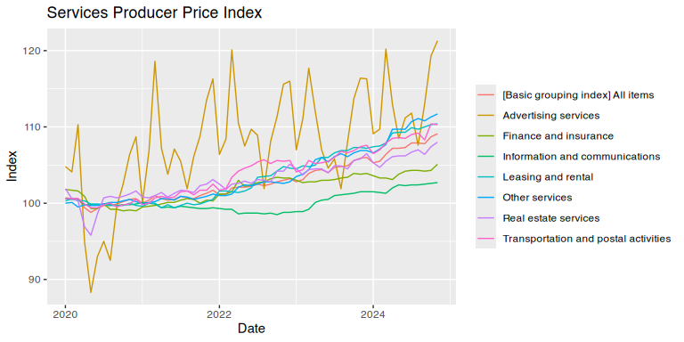

BOJ
================

[](http://cran.r-project.org/package=BOJ)
[](http://cran.r-project.org/package=BOJ)

The `BOJ` package provides an `R` interface to [Bank of
Japan](https://www.boj.or.jp/) statistics, specifically the [flat
files](https://www.stat-search.boj.or.jp/info/dload_en.html) available
on the [BOJ Time-Series Data](https://www.stat-search.boj.or.jp/)
portal.

## Install package

The package can be installed from CRAN or Github.

``` r
library(devtools)
install_github("stefanangrick/BOJ")  # GitHub
install.packages("BOJ")              # CRAN
```

## Example usage

To import data, first load the package.

``` r
library("BOJ")
```

Next, run the `get_boj_datasets()` function to obtain a list of
available data sets.

``` r
ds <- get_boj_datasets()
ds
```

    ## # A tibble: 16 × 3
    ##    desc                                                              name  url  
    ##    <chr>                                                             <chr> <chr>
    ##  1 "Corporate Goods Price Index (CGPI)"                              cgpi… http…
    ##  2 "Producer Price Index using chain-weighted index formula"         cgpi… http…
    ##  3 "Services Producer Price Index (SPPI)"                            sppi… http…
    ##  4 "Wholesale Services Price Index"                                  sppi… http…
    ##  5 "Flow of Funds"                                                   fof   http…
    ##  6 "Flow of Funds (with name of time-series, etc.)"                  fof2… http…
    ##  7 "TANKAN"                                                          co    http…
    ##  8 "TANKAN (Fixed Investment and Software Investment)(Compiled unde… cole… http…
    ##  9 "Balance of Payments "                                            bp_m… http…
    ## 10 "Regional Balance of Payments (quarterly)"                        regb… http…
    ## 11 "International Investment Position (Quarterly Data) & Gross Exte… qiip… http…
    ## 12 "International Investment Position (Calendar Year Data)"          iip_… http…
    ## 13 "BIS International Locational Banking Statistics in Japan (Claim… bis1… http…
    ## 14 "BIS International Locational Banking Statistics in Japan (Liabi… bis1… http…
    ## 15 "BIS International Consolidated Banking Statistics in Japan (Imm… bis2… http…
    ## 16 "BIS International Consolidated Banking Statistics in Japan (Ult… bis2… http…

The `get_boj_datasets()` function returns a
[tibble](https://tibble.tidyverse.org/) data frame listing the available
data sets. The column `url` can be used as input for the `get_boj()`
function which downloads, parses and imports the corresponding data set.

To import monthly-frequency data on Japan’s [Services Producer Price
Index](https://www.boj.or.jp/en/statistics/pi/sppi_2015/index.htm/), run
the below.

``` r
sppi <- get_boj(ds$url[(ds$name == "sppi_m_en")])
sppi
```

    ## # A tibble: 48,355 × 5
    ##    code              desc                                    struc date  obs_v…¹
    ##    <chr>             <chr>                                   <chr> <chr>   <dbl>
    ##  1 PRCS15_5200000000 Services Producer Price Index (2015 ba… [Ser… 2015…    99.6
    ##  2 PRCS15_5200000000 Services Producer Price Index (2015 ba… [Ser… 2015…    99.7
    ##  3 PRCS15_5200000000 Services Producer Price Index (2015 ba… [Ser… 2015…   100. 
    ##  4 PRCS15_5200000000 Services Producer Price Index (2015 ba… [Ser… 2015…   100  
    ##  5 PRCS15_5200000000 Services Producer Price Index (2015 ba… [Ser… 2015…   100. 
    ##  6 PRCS15_5200000000 Services Producer Price Index (2015 ba… [Ser… 2015…   100  
    ##  7 PRCS15_5200000000 Services Producer Price Index (2015 ba… [Ser… 2015…   100. 
    ##  8 PRCS15_5200000000 Services Producer Price Index (2015 ba… [Ser… 2015…   100. 
    ##  9 PRCS15_5200000000 Services Producer Price Index (2015 ba… [Ser… 2015…    99.9
    ## 10 PRCS15_5200000000 Services Producer Price Index (2015 ba… [Ser… 2015…    99.9
    ## # … with 48,345 more rows, and abbreviated variable name ¹​obs_value

To plot the data using [ggplot2](https://ggplot2.tidyverse.org), run the
below.

``` r
library("dplyr")
library("ggplot2")
library("zoo")

sppi_plot <- subset(sppi, code %in% c("PRCS15_5200000000", "PRCS15_5200010001",
                                      "PRCS15_5200010002", "PRCS15_5200010003",
                                      "PRCS15_5200010004", "PRCS15_5200010005",
                                      "PRCS15_5200010006", "PRCS15_5200010007"))
sppi_plot <- mutate(sppi_plot, date = as.Date(as.yearmon(date, format = "%Y%m")))
sppi_plot <- mutate(sppi_plot, struc = gsub("^Major group/ ", "", struc))
sppi_plot <- subset(sppi_plot, !is.na(obs_value))

ggplot(sppi_plot, aes(x = date, y = obs_value)) +
  geom_line(aes(colour = struc)) +
  labs(title = "Services Producer Price Index (2015 base)",
       x = "Date", y = "Index")
```

<!-- -->

Note that BOJ data sets come with a number of different time formats.
The [zoo](https://cran.r-project.org/package=zoo) package
(e.g. `as.yearmon()`) should be able to parse most formats.

## Note

This package is in no way officially related to or endorsed by the [Bank
of Japan](https://www.boj.or.jp/). It was inspired by the [BIS R
package](https://github.com/expersso/BIS). Please don’t abuse the BOJ’s
servers with unnecessary calls.
